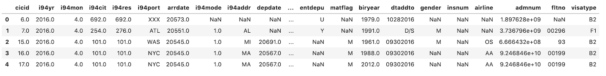
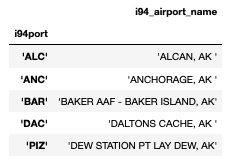
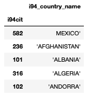
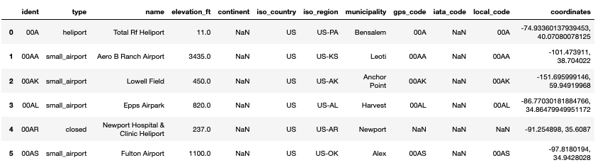
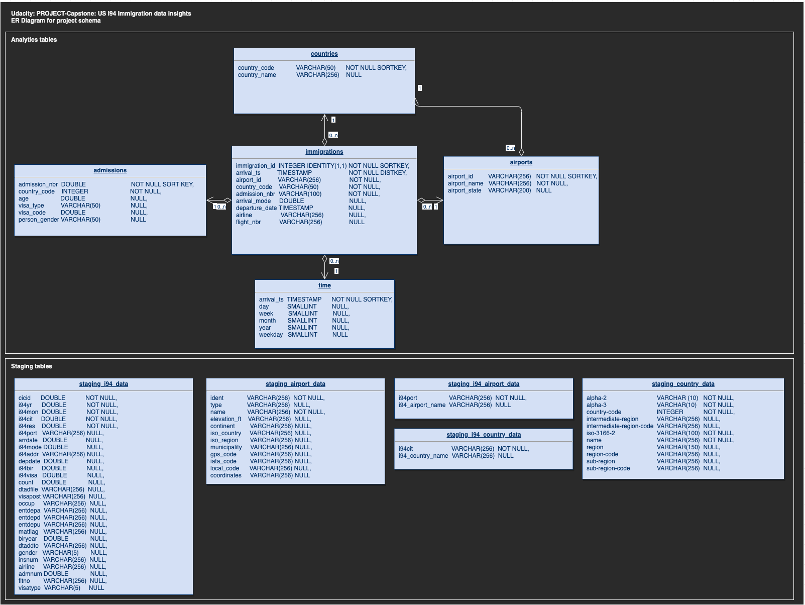

_(Udacity: Data Engineering Nano Degree) | jukka.kansanaho@gmail.com | 2019-08-14_

# PROJECT-CAPSTONE: US I94 Immigration Insights

## Quick start

After installing python3 + Apache Spark (pyspark) libraries and dependencies, run from command line:

* `python3 etl.py` (to process all the input data into Spark parquet files.)

## Overview

This Project-Capstone handles US I94 immigration data and uses airport code data and country code data as a support. Input data is in "Data Lake": Immigration data is in SAS7BDAT format, Airport data is in CSV format, and CountryCode data is in JSON format. Usually Data Lake stores data in Cloud storage e.g. Amazon AWS.

See short descriptions of the data below:

* **data/18-83510-I94-Data-2016/**: US I94 immigration data from 2016 (Jan-Dec).

  * Source: US National Tourism and Trade Office https://travel.trade.gov/research/reports/i94/historical/2016.html
  * Description: I94_SAS_Labels_Descriptions.txt file contains descriptions for the I94 data.
    * I94 dataset has SAS7BDAT file per each month of the year (e.g. i94_jan16_sub.sas7bdat).
    * Each file contains about 3M rows
    * Data has 28 columns containing information about event date, arriving person, airport, airline, etc.
  * I94 immigration data example:
  * 
  * NOTE: This data is behind a pay wall and need to be purchased to get access. Data is available for Udacity DEND course.

  * **data/i94_airport_codes.xlsx**: Airport codes and related cities defined in I94 data description file.

    * Source: https://travel.trade.gov/research/reports/i94/historical/2016.html
    * Description: I94 Airport codes data contains information about different airports around the world.
      * Columns: i94port, i94_airport_name
      * Data has 660 rows and 2 columns.
    * I94 Airport Code example:
    * 

  * **data/i94_country_codes.xlsx**: Country codes defined in US I94 Immigration data description file.

    * Source: https://travel.trade.gov/research/reports/i94/historical/2016.html
    * Description: I94 Country codes data contains information about countries people come to US from.
      * Columns: i94cit, i94_country_code
      * Data has 289 rows and 2 columns.
    * I94 Country Code example:
    * 

  * **data/airport-codes.csv**: Airport codes and related cities.

    * Source: https://datahub.io/core/airport-codes#data
    * Description: Airpot codes data contains information about different airports around the world.
      * Columns: Airport code, name, type, location, etc.
      * Data has 48304 rows and 12 columns.
    * Airport Code example:
    * 

  * **data/iso-3166-country-codes.json**: World country codes (ISO-3166)

    * Source: https://github.com/lukes/ISO-3166-Countries-with-Regional-Codes
      ISO-3166-1 and ISO-3166-2 Country and Dependent Territories Lists with UN Regional Codes
    * ISO-3166: https://www.iso.org/iso-3166-country-codes.html
    * Country Code example:
    * 

Project builds an ETL pipeline (Extract, Transform, Load) to Extract data from input files into staging tables, process the data into fact and dimension tables. As technologies, Project-Capstone uses python and Apache Spark. Input data can be stored e.g. in Amazon AWS S3 or locally. Output parquet files can be written e.g. back to S3 or to local file storage.

---

## About Database

Weather and Emission analytics database schema has a star design. Start design means that it has one Fact Table having business data, and supporting Dimension Tables. Star DB design is maybe the most common schema used in ETL pipelines since it separates Dimension data into their own tables in a clean way and collects business critical data into the Fact table allowing flexible queries.
The Fact Table can be used to answer for example the following question: Is there correlation between countries' emissions and temperature.

DB schema is the following:

_*I94-ImmigrationInsights schema as ER Diagram.*_

### Purpose of the database and ETL pipeline

Purpose of this Data Lake based ETL pipeline solution is to automate data cleaning, processing and analysis steps for various weather data sources.

### Raw JSON data structures

* **...**: ...

### Fact Table

* **...**: ...

### Dimension Tables

* **...**: ...

## About ETL pipeline design

Project-Capstone contains the following configuration files:

* **dl.cfg**: config file defining paths to input data, output data, potential AWS credentials, etc.
* **dl_template.cfg**: config file template

  NOTE: rename this from dl_template.cfg => dl.cfg and add your parameters.

---

## HOWTO use

**Project has one script:**

* **etl.py**: This ETL pipeline script uses data stored locally or in in Amazon AWS S3, processes and cleans data, and writes the processed data into parquet files.

### Prerequisites

* **Python3** is recommended as the environment. The most convenient way to install python is to use Anaconda (https://www.anaconda.com/distribution/) either via GUI or command line.

Also, the following libraries are needed for the python environment to make Jupyter Notebook and Apache Spark to work:

* _pyspark_ (+ dependencies) to enable script to create a SparkSession. (See https://spark.apache.org/docs/latest/api/python/pyspark.sql.html)
* NOTE: in the beginning of the execution, script downloads hadoop-aws package to enable connection to AWS.

* _pandas_ to read some of the input files into a format that Spark can understand.

### Run ETL pipeline

Type to command line:

`python3 etl.py`

* ...

Output: ...

## Example queries

* ...

## Summary

Project-Capstone provides tools to automatically process, clean, analyze US I94 Immigration data in a flexible way and help answering questions like "Which US airports people used most to immigrate US?"
