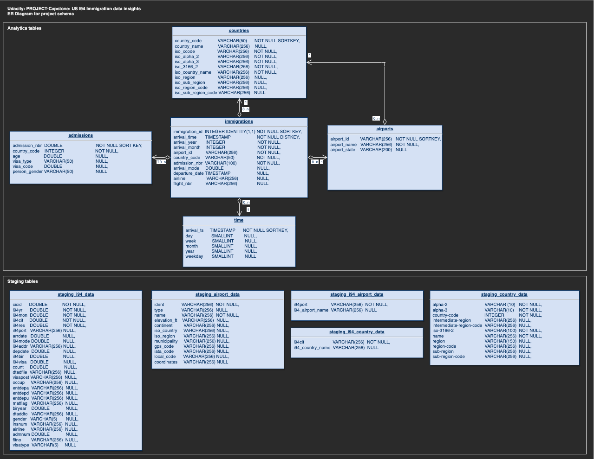

_(Udacity: Data Engineering Nano Degree) | jukka.kansanaho@gmail.com | 2019-08-21_

# PROJECT-CAPSTONE: US I94 Immigration Insights

## Quick start

After installing python3 + Apache Spark (pyspark) libraries and dependencies, run from command line:

* `python3 etl.py` (to process all the input data into Spark parquet files.)

## Overview

This Project-Capstone handles US I94 immigration data and uses airport code data and country code data as a support. Input data is in "Data Lake": Immigration data is in SAS7BDAT format, Airport data is in CSV format, and CountryCode data is in JSON format. Usually Data Lake stores data in Cloud storage e.g. Amazon AWS.

See short descriptions of the data below:

* **data/18-83510-I94-Data-2016/**: US I94 immigration data from 2016 (Jan-Dec).

  * Source: US National Tourism and Trade Office https://travel.trade.gov/research/reports/i94/historical/2016.html
  * Description: I94_SAS_Labels_Descriptions.txt file contains descriptions for the I94 data.
    * I94 dataset has SAS7BDAT file per each month of the year (e.g. i94_jan16_sub.sas7bdat).
    * Each file contains about 3M rows
    * Data has 28 columns containing information about event date, arriving person, airport, airline, etc.
  * I94 immigration data example:
  * 
  * NOTE: This data is behind a pay wall and need to be purchased to get access. Data is available for Udacity DEND course.

  * **data/i94_airport_codes.xlsx**: Airport codes and related cities defined in I94 data description file.

    * Source: https://travel.trade.gov/research/reports/i94/historical/2016.html
    * Description: I94 Airport codes data contains information about different airports around the world.
      * Columns: i94port, i94_airport_name
      * Data has 660 rows and 2 columns.
    * I94 Airport Code example:
    * 

  * **data/i94_country_codes.xlsx**: Country codes defined in US I94 Immigration data description file.

    * Source: https://travel.trade.gov/research/reports/i94/historical/2016.html
    * Description: I94 Country codes data contains information about countries people come to US from.
      * Columns: i94cit, i94_country_code
      * Data has 289 rows and 2 columns.
    * I94 Country Code example:
    * 

  * **data/airport-codes.csv**: Airport codes and related cities.

    * Source: https://datahub.io/core/airport-codes#data
    * Description: Airpot codes data contains information about different airports around the world.
      * Columns: Airport code, name, type, location, etc.
      * Data has 48304 rows and 12 columns.
    * Airport Code example:
    * 

  * **data/iso-3166-country-codes.json**: World country codes (ISO-3166)

    * Source: https://github.com/lukes/ISO-3166-Countries-with-Regional-Codes
      ISO-3166-1 and ISO-3166-2 Country and Dependent Territories Lists with UN Regional Codes
    * ISO-3166: https://www.iso.org/iso-3166-country-codes.html
    * Country Code example:
    * 

Project builds an ETL pipeline (Extract, Transform, Load) to Extract data from input files into staging tables, process the data into fact and dimension tables. As technologies, Project-Capstone uses python and Apache Spark. Input data can be stored e.g. in Amazon AWS S3 or locally. Output parquet files can be written e.g. back to S3 or to local file storage.

---

## About Database

US I94 Immigrants Insights database schema has a star design. Start design means that it has one Fact Table having business data, and supporting Dimension Tables. Star DB design is maybe the most common schema used in ETL pipelines since it separates Dimension data into their own tables in a clean way and collects business critical data into the Fact table allowing flexible queries.
The Fact Table can be used to answer for example the following question: How much different nationalities came to US through which airport.

DB schema is the following:

_*I94-ImmigrationInsights schema as ER Diagram.*_

### Purpose of the database and ETL pipeline

Purpose of this Data Lake based ETL pipeline solution is to automate data cleaning, processing and analysis steps for various weather data sources.

### Data Dictionary

You can find details about the DB schema dictionary dictionary from [data_dictionary.json](./data_dictionary.json) file. This file describes all the DB fields and their source.

### Findings about input data

US I94 Immigration data set (used in this project) consists of 12 sas7bdat files for year 2016 - each per month. There are several non-standard codes only used in I94 data, which made combining the date to other data sets hard.

* I94_SAS_Labels_Descriptions [I94_SAS_Labels_Descriptions](./data/I94_SAS_Labels_Descriptions.txt) file content was used to manually copy-paste the descriptions of country and airport information to XLS file, mapping I94 country codes to ISO-3166 country codes, and from there further processing it as a part of the ETL pipeline. This allows to combine e.g. ISO-3166 data set into DB's countries table.
* I94 Immigration data set doesn't identify immigrants on a very detailed level => only some information was possible to extract from the data into admissions table.
* Potential further work: map I94 airport codes to IATA airport codes => combine IATA airport data set into the DB's airports table.

## About ETL pipeline design

Project-Capstone contains the following configuration files:

* **dl.cfg**: config file defining paths to input data, output data, potential AWS credentials, etc.
* **dl_template.cfg**: config file template

  NOTE: rename this from dl_template.cfg => dl.cfg and add your parameters.

---

## HOWTO use

**Project has one script:**

* **etl.py**: This ETL pipeline script uses data stored locally or in in Amazon AWS S3, processes and cleans data, and writes the processed data into parquet files.

### Prerequisites

* **Python3** is recommended as the environment. The most convenient way to install python is to use Anaconda (https://www.anaconda.com/distribution/) either via GUI or command line.

Also, the following libraries are needed for the python environment to make Jupyter Notebook and Apache Spark to work:

* _pyspark_ (+ dependencies) to enable script to create a SparkSession. (See https://spark.apache.org/docs/latest/api/python/pyspark.sql.html)
* NOTE: in the beginning of the execution, script downloads saurfang:spark-sas7bdat package to enable Spark to process SAS files.

* _pandas_ to read some of the input files into a format that Spark can understand.

### Run ETL pipeline

Type to command line:

`python3 etl.py`

* First, ETL script reads in configuration settings (dl.cfg). Script also re-orders I94 inout files to process them in right order (Jan => Dec).
* ETL script takes input data (I94 data, I94 country data, I94 airport data, ISO-3166 country data, IATA airport data).
* Raw input data is read into pandas dataframe, and from there to Spark dataframe and stored into parquet staging files.
* Staging parquet files are read back to Spark dataframes and cleaned (when necessary) and some further data is extracted from the original data.
* Each star schema table is processed in order: admissions => countries => airports => time => immigrations
* Finally, data quality checks are run for each table to validate the output (key columns don't have nulls, each table has content). A summary of the quality check is provided and written in console.
* During the execution, ETL script prints out information about the progress of the script execution.

---

## Project write-up

**Rationale for the tools selection:**

* Python, Pandas and Spark were natural choises to process project's input data since it contains all necessary (and easy to use) libraries to read, clean, process, and form DB tables.
* Since the data set was still limited, local and server storage was used in storing, reading, writing the input and output data.
* Input data could have been stored in AWS without big problems (excluded in this project).
* Output data could have been easily written to AWS after processing (excluded in this project). Experiences have shown that it's better to write parquet files locally first and only after that write them to cloud storage (as a bulk operation) to avoid delays and extra costs caused by AWS S3.

**How often ETL script should be run:**

* ETL script should be run monthly basis (assuming that new I94 data is available once per month).

**Other scenarions (what to consider in them):**

* Data is 100x:
  * Input data should be stoted in cloud storage e.g. AWS S3
  * Clustered Spark should be used to enable parallel processing of the data.
  * Clustered Cloud DB e.g. AWS Redshift should be used to store the data during the processing (staging and final tables).
  * Output data (parquet files) should be stored to Cloud storage e.g. AWS S3 for easy access or to a Cloud DB for further analysis. AWS Redshift is very expensive for storing the data, so maybe some SQL DB (e.g. AWS RDS) should be used.
* Data is used in dashboard and updated every day 07:00AM:

  * ETl script should be refactored to process only the changed inout information instead of processing all the inout files as it does now to minimise the used time and computing resources.
  * Output data should be stored and updated in a Cloud DB (e.g. AWS RDS) to make it available all times for the dashboard.
  * Possibly this "always available" DB (serving the dashboard) would contain a latest sub-set of all available data to make it fast performing and easier to manage.

* DB is accessed by 100+ people:
  * Output data should be stored in a Cloud DB (e.g. AWS RDS) to make it "always available" for further analysis. Tools should be provided for the end-users to access the output DB.
  * Potentially, some new tables could be created to serve the most used queries better.

**Potential further work:**

* ETL pipeline script could be re-factored
  * make it more modular (split functions to separate files/classes)
  * combine functions to have fewer, more general purpose functions instead of several specific function per ETL steps
  * UDFs (User Defined Functions) in process_time_data() and process_immigrations_data() functions
    * UDFs are used to generate timestamps from SAS timestamps
    * UDFs are killing the performance of the ETL script => UDFs should be replaced with some other way to make script perform better.
* IATA airport data could be (semi-manually) mapped to I94 airport data to add more value for the analysis and enable further data merges.

* Other data e.g. daily weather data could be combined as inout data to provide insights about the weather immigrants experienced when they entered US.

## Summary

Project-Capstone provides tools to automatically process, clean, analyze US I94 Immigration data in a flexible way and help answering questions like "Which US airports people used most to immigrate US?"
