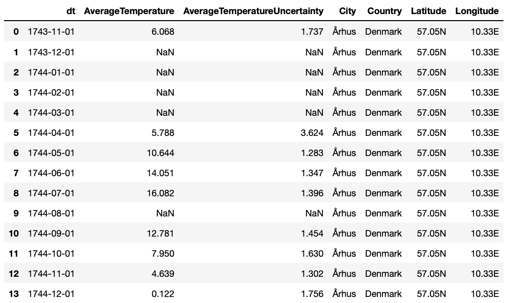
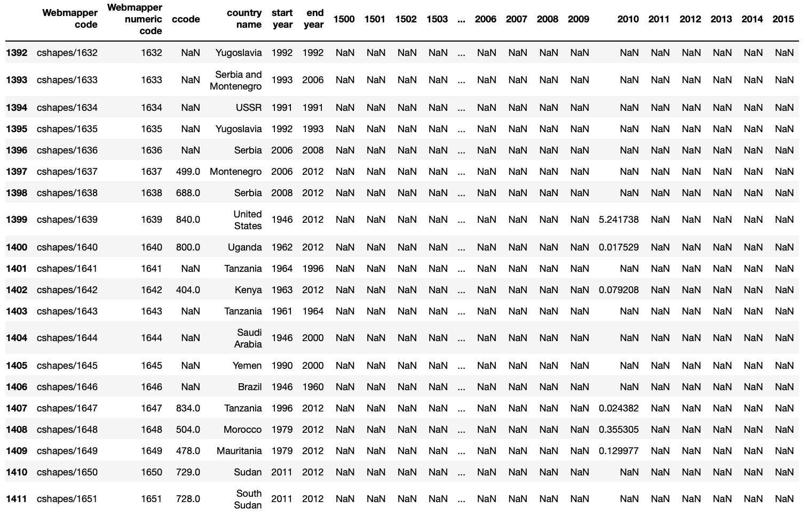
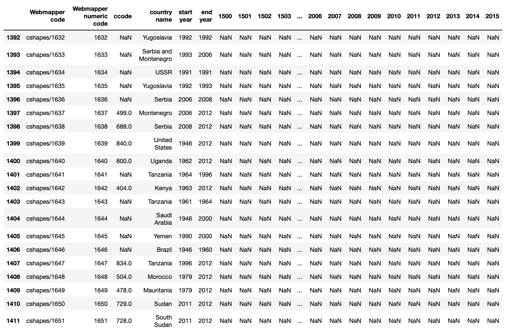
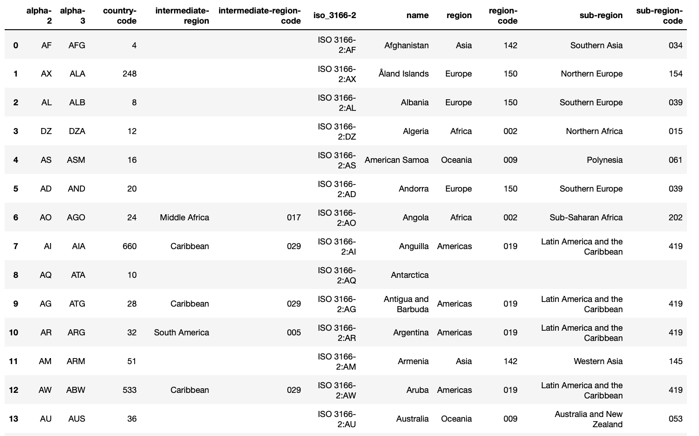

_(Udacity: Data Engineering Nano Degree) | jukka.kansanaho@gmail.com | 2019-08-03_

# PROJECT-CAPSTONE: World Temperature vs CO2 and SO2 Emissions

## Quick start

After installing python3 + Apache Spark (pyspark) libraries and dependencies, run from command line:

* `python3 etl.py` (to process all the input data into Spark parquet files.)

## Overview

This Project-Capstone handles World weather data (by Berkeley Earth project: ) and CO2 + SO2 emission data (by Clio Infra). Input data is in "Data Lake": Weather data is in CSV format, emission data is in XLXS format, and CountryCode data is in JSON format. Usually Data Lake stores data in Cloud storage e.g. Amazon AWS. See short descriptions of the data below:

* **data/GlobalLandTemperaturesByCity.csv**: World land temperatures by city
  Source: https://www.kaggle.com/berkeleyearth/climate-change-earth-surface-temperature-data/
  Temperature-data example:
  

  NOTE: Please unzip climate-change-earth-surface-temperature-data.zip and move files to /data folder. GlobalLandTemperaturesByCity.csv si used primary in this ETL pipeline.

* **data/CO2_Emissions_Capita-historical.xlsx**: CO2 emission data by country
  Source: https://clio-infra.eu/Indicators/CO2EmissionsperCapita.html
  => https://datasets.socialhistory.org/dataset.xhtml?persistentId=hdl:10622/DG654S
  CO2 Emissions per Capita (1500-2000)
  Last update: 2012-09-01
  CO2-emission example:
  

* **data/SO2_Emissions_Capita-historical.xlsx**: SO2 emission data by country
  Source: https://clio-infra.eu/Indicators/SO2EmissionsperCapita.html
  => https://datasets.socialhistory.org/dataset.xhtml?persistentId=hdl:10622/IRT0YU
  SO2 Emissions per Capita (1850-2000)  
  Last update: 2013-05-18
  SO2-emission example:
  

* **data/iso-3166-country-codes.json**: country codes (ISO-3166)
  Source: https://github.com/lukes/ISO-3166-Countries-with-Regional-Codes
  ISO-3166-1 and ISO-3166-2 Country and Dependent Territories Lists with UN Regional Codes
  ISO-3166: https://www.iso.org/iso-3166-country-codes.html
  Country Code example:
  

  Below, some figures about the data set (results after running the `etl.py`):

* ...

Project builds an ETL pipeline (Extract, Transform, Load) to Extract data from input files into staging tables, process the data into fact and dimension tables. As technologies, Project-Capstone uses python and Apache Spark. Input data can be stored e.g. in Amazon AWS S3 or locally. Output parquet files can be written e.g. back to S3 or to local file storage.

---

## About Database

Weather and Emission analytics database schema has a star design. Start design means that it has one Fact Table having business data, and supporting Dimension Tables. Star DB design is maybe the most common schema used in ETL pipelines since it separates Dimension data into their own tables in a clean way and collects business critical data into the Fact table allowing flexible queries.
The Fact Table can be used to answer for example the following question: Is there correlation between countries' emissions and temperature.

DB schema is the following:

_*WeatherAndEmissionDB schema as ER Diagram.*_

### Purpose of the database and ETL pipeline

Purpose of this Data Lake based ETL pipeline solution is to automate data cleaning, processing and analysis steps for various weather data sources.

### Raw JSON data structures

* **...**: ...

### Fact Table

* **...**: ...

### Dimension Tables

* **...**: ...

## About ETL pipeline design

Project-Capstone contains the following configuration files:

* **dl.cfg**: config file defining paths to input data, output data, potential AWS credentials, etc.
* **dl_template.cfg**: config file template

  NOTE: rename this from dl_template.cfg => dl.cfg and add your parameters.

---

## HOWTO use

**Project has one script:**

* **etl.py**: This ETL pipeline script uses data stored locally or in in Amazon AWS S3, processes and cleans data, and writes the processed data into parquet files.

### Prerequisites

* **Python3** is recommended as the environment. The most convenient way to install python is to use Anaconda (https://www.anaconda.com/distribution/) either via GUI or command line.

Also, the following libraries are needed for the python environment to make Jupyter Notebook and Apache Spark to work:

* _pyspark_ (+ dependencies) to enable script to create a SparkSession. (See https://spark.apache.org/docs/latest/api/python/pyspark.sql.html)
* NOTE: in the beginning of the execution, script downloads hadoop-aws package to enable connection to AWS.

* _pandas_ to read some of the input files into a format that Spark can understand.

### Run ETL pipeline

Type to command line:

`python3 etl.py`

* ...

Output: ...

## Example queries

* ...

## Summary

Project-Capstone provides tools to automatically process, clean, analyze weather and emission data in a flexible way and help answering questions like "Is there correlation between country emissions and world temperature?"
